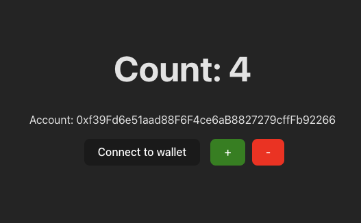

# Counter Chain DApp

Simple decentralized counter app.



## Run Tests

```bash
npx hardhat test
```

## Run RPC Server

```bash
npx hardhat node
```

## Deploy contract

```bash
npx hardhat run ./ignition/modules/Counter.js --network localhost
```

## Run React App

Before you should install Metamask wallet extension and paste development
deployer account in your wallet profile.

```bash
npm run dev
```